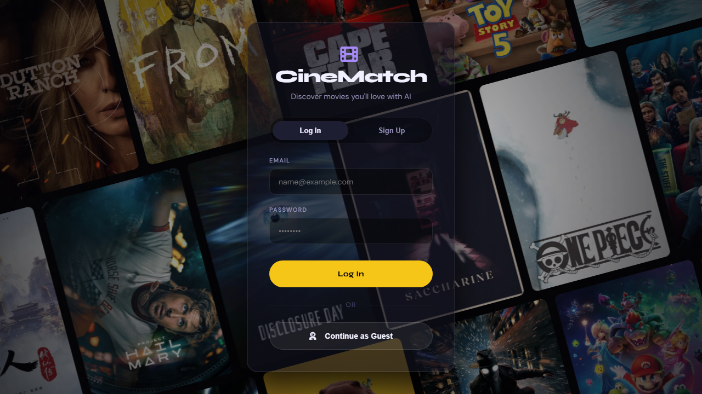

# 🎬 ATLASS
### *Adaptive Taste Learning And Suggestion System*

> A cinematic discovery experience powered by collaborative filtering, live TMDb metadata, and a WebGL circular roulette — all in vanilla JavaScript with zero frameworks.

---

## What is ATLASS?

ATLASS is a full-stack, browser-native movie recommendation engine that feels like a streaming platform but thinks like a machine learning model. It fuses two data pipelines — the **MovieLens ml-latest-small** dataset for offline collaborative filtering and the **TMDb API** for live metadata — to serve deeply personalized recommendations the moment you open the page.

The interface is built from scratch: no React, no Vue, no component library. Just modular ES modules, a custom WebGL gallery renderer (ported from OGL), and a design system that blends the visual language of Netflix, A24, and a high-end editorial magazine.

---

## Preview



---

## Feature Breakdown

### Recommendation Engine
- **Cosine Similarity Collaborative Filtering** — compares your in-browser rating history against 610 real MovieLens users to surface movies you haven't seen but would likely rate highly
- **TMDb Live Mode** — when an API key is configured, recommendations are fetched in real-time from `GET /movie/{id}/recommendations`
- **Match Score System** — every card shows a `%` match badge computed either from the cosine similarity prediction or from a deterministic hash of the movie ID as a fallback
- **Preference Boosts** — selecting favorite genres (+4% per match) and preferred streaming platforms (+5%) dynamically adjusts the match score for every visible card

### Content Discovery UI
- **Hero Section** — autoplay cinematic backdrop with a Ken Burns zoom animation, synopsis, AI reasoning tag, and watchlist CTA
- **Horizontally Scrollable Rows** — "Top Picks For You" and "Because You Watched ___" rows with Netflix-style hover popups that float outside card overflow bounds
- **Trending Section** — pulls `GET /trending/movie/day` in live mode or falls back to curated MovieLens IDs in offline mode, with numbered overlays (#1–10)
- **Platform Browser** — browse movies and series by streaming service (Netflix, Prime Video, Apple TV+, Disney+, Max, MUBI) with a Movies / Series toggle
- **Search** — full-text search across the loaded movie database with a live results row
- **Surprise Me Orb** — randomly surfaces a movie from the full catalog with a satisfying orb animation
- **Genre Popover** — hoverable genre chips that show sub-genre breakdowns

### Watchlist & Roulette of Fate
- Persistent watchlist stored in `localStorage`, synced across every card's quick-add button and the floating popup
- When 2+ movies are added, the **Roulette of Fate** unlocks — a WebGL-powered `CircularGallery` built on OGL that curves movie posters across a 3D arc
- Click "Spin It!" and the gallery accelerates to a programmatically chosen target index, accompanied by synthesized sound effects, then snaps and reveals "Tonight's Pick"
- Configurable via Settings: confetti toggle and bend curvature intensity (0.0–5.0)

### Movie Detail Modal
- Full-bleed backdrop + poster with a layered gradient
- TMDb rating, runtime, genre, streaming platforms
- YouTube trailer embed (via `GET /movie/{id}/videos`)
- 5-star user rating system persisted to `localStorage`
- Cast and director grid with profile photos
- AI reasoning pills ("Why ATLASS picked this")
- "Not Interested" action

### Settings Panel (3 tabs)
| Tab | What it does |
|-----|-------------|
| API | Enter and test a TMDb v3 API key; view MovieLens CSV load status |
| Preferences | Pick favorite genres and streaming platforms to tune match scores |
| Roulette | Toggle confetti, adjust WebGL bend curvature |

### Authentication
- Login / Sign Up form on the landing page with a grid-motion animated background
- Guest mode bypasses auth entirely
- Session stored in `localStorage`; logout clears state and returns to landing

### Theme
- Full **dark / light mode** toggle with a custom sliding toggle button
- Light theme remaps all CSS custom properties (`--b0` through `--b5`, `--t1`–`--t3`, accent colors) without touching any component markup

---

## Tech Stack

| Layer | Technology |
|-------|-----------|
| Language | Vanilla JavaScript (ES Modules) |
| Rendering | DOM + WebGL via [OGL](https://github.com/oframe/ogl) |
| ML Model | Cosine Similarity Collaborative Filtering |
| Dataset | [MovieLens ml-latest-small](https://grouplens.org/datasets/movielens/) (9,742 movies, 100,836 ratings) |
| Live Data | [TMDb API v3](https://developer.themoviedb.org/docs) |
| Fonts | Syne (headings) + DM Sans (body) via Google Fonts |
| Icons | Font Awesome 6 |
| Animation | CSS keyframes + GSAP (pill nav) + Web Audio API (sound) |
| State | Single shared `state` object + `localStorage` |
| Build | None — runs directly in the browser |

---

## Project Structure

```
atlass/
├── index.html          # Single-page shell — all sections, modals, overlays
├── style.css           # ~2600 lines of hand-written CSS with custom properties
├── app.js              # Entry point — orchestrates init sequence
├── state.js            # Shared reactive state + localStorage helpers
├── config.js           # TMDb API key, protocol detection, default rec IDs
├── recommender.js      # Collaborative filtering engine + MovieLens CSV loader
├── data.js             # 12-movie fallback dataset with full metadata
├── ui.js               # All DOM rendering: cards, rows, trending, modal, popup
├── CircularGallery.js  # WebGL OGL-based 3D circular gallery (Roulette)
├── PillNav.js          # GSAP-powered animated pill navigation
└── data/
    └── ml-latest-small/
        ├── movies.csv  # 9,742 movies with titles and genres
        ├── ratings.csv # 100,836 ratings from 610 users
        ├── links.csv   # MovieLens → TMDb / IMDb ID mapping
        └── tags.csv    # User-applied tags
```

---

## How the Recommendation Engine Works

```
User rates a movie (1–5 stars)
        │
        ▼
Stored in localStorage as { movieId: rating }
        │
        ▼
Mapped against 610 MovieLens user rating vectors
        │
        ▼
Cosine similarity computed per user:
  sim(u, v) = (u · v) / (‖u‖ × ‖v‖)
        │
        ▼
Top 30 most similar users selected
        │
        ▼
Weighted average prediction per unseen movie:
  score(m) = Σ(sim × rating) / Σ(sim)
        │
        ▼
Sorted descending → top 10 surfaced in "Top Picks For You"
        │
        ▼
Match % = clamp(75 + (score / 5.0) × 24, 75, 99)
```

In **live TMDb mode**, this is replaced by `GET /movie/{seedId}/recommendations` seeded from the first item in your watchlist.

---

## Running Locally

The app ships with a pre-configured TMDb API key, so it works immediately from a web server.

```bash
# Python (recommended)
python -m http.server 8080

# Node.js
npx serve .

# Then open
http://localhost:8080
```

> **Important:** Do not open `index.html` directly via `file://`. The browser's CORS policy blocks `fetch()` calls to local CSV files and the TMDb API. Always use a local web server.

### Using Your Own TMDb API Key
1. Get a free key at [themoviedb.org/settings/api](https://www.themoviedb.org/settings/api)
2. Open the app → click your avatar → Settings → API tab
3. Paste the key and hit **Test**
4. A green indicator confirms the connection; the page reloads with live data

### Offline Mode (No API Key)
Remove or clear the TMDb key in Settings. The app switches to:
- MovieLens CSV files for movie metadata and recommendations
- Unsplash placeholder images for posters
- Deterministic match scores based on movie ID hashing

---

## Data Sources

- **MovieLens ml-latest-small** — F. Maxwell Harper and Joseph A. Konstan. 2015. The MovieLens Datasets: History and Context. ACM Transactions on Interactive Intelligent Systems (TiiS) 5, 4: 1–19.
- **TMDb** — This product uses the TMDb API but is not endorsed or certified by TMDb.

---

## Browser Compatibility

| Feature | Requirement |
|---------|------------|
| ES Modules | Chrome 61+, Firefox 60+, Safari 10.1+ |
| WebGL (CircularGallery) | Any GPU-accelerated browser |
| Web Audio API (sound FX) | Chrome, Firefox, Safari |
| CSS custom properties | All modern browsers |

---

## License

Built for educational and portfolio purposes. MovieLens data is used under the [GroupLens Research license](https://grouplens.org/datasets/movielens/). TMDb data is subject to [TMDb Terms of Use](https://www.themoviedb.org/documentation/api/terms-of-use).
